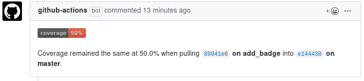

# golang ci template using github actions


[](https://github.com/jandelgado/golang-ci-template-github-actions/actions?workflow=test%20and%20build)
[](https://coveralls.io/github/jandelgado/golang-ci-template-github-actions?branch=master)
[](https://goreportcard.com/report/github.com/jandelgado/golang-ci-template-github-actions) 


<!-- vim-markdown-toc GFM -->

* [Info](#info)
* [Creating a release](#creating-a-release)
* [Test coverage (coveralls)](#test-coverage-coveralls)
* [Author](#author)

<!-- vim-markdown-toc -->

## Info 

This repository serves as a template for github-actions integrated go projects.
It consists of a `hello, world!` like example in source file [main.go](main.go)
which gets compiled into the binary `golang-ci-template-github-actions`. The CI
runs some [linters](https://github.com/golangci/golangci-lint-action) on the
code, before the unit tests are executed. Test coverage is uploaded to
coveralls.io.

[goreleaser](https://github.com/goreleaser/goreleaser) is used to create the
final multi-plattform assets, which are automatically uploaded to the 
[release](https://github.com/jandelgado/golang-ci-template-github-actions/releases/latest).
The [release-process](#creating-a-release) is triggered by pushing a git tag to
the repository.

Finally, a docker image is built, which gets published to
[ghcr.io](https://github.com/jandelgado/golang-ci-template-github-actions/pkgs/container/golang-ci-template-github-actions).
Run it with

```console
$ docker run --rm  ghcr.io/jandelgado/golang-ci-template-github-actions:latest
hello, world!
```

## Creating a release

A new release is created by creating a git tag and pushing it, e.g.:

```console
$ git tag -a "v1.2.3" -m "this is release v1.2.3"
$ git push origin v1.2.3
```

The push of the new tag triggers the CI, which uses goreleaser to:
* build multiplatform release artifacts
* create a new release 
* upload the artifacts, which are then available on the [releases page](/jandelgado/golang-ci-template-github-actions/releases). 

Finally, a docker image is built, which gets published to
[ghcr.io](https://github.com/jandelgado/golang-ci-template-github-actions/pkgs/container/golang-ci-template-github-actions).

## Test coverage (coveralls)

We use the
[gcov2lcov-action](https://github.com/marketplace/actions/gcov2lcov-action) to
first convert the golang test coverage to lcov format and then upload it using
the [coveralls github
action](https://github.com/marketplace/actions/coveralls-github-action).

Don't forget to enable `Leave comments (x) ` in coveralls, under `repo
settings` > `pull request alerts`, so that the coveralls-action posts a comment
with the test coverage to affected pull requests:



## Author

(c) copyright 2021 by Jan Delgado

