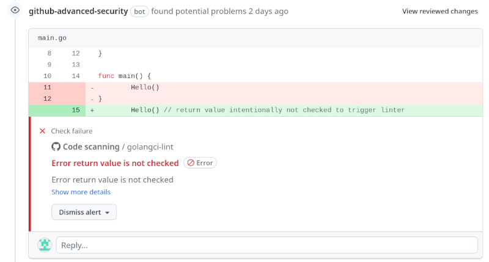
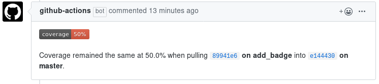

# golang ci template using github actions

[](https://github.com/jandelgado/golang-ci-template-github-actions/actions?workflow=run%20tests)
[](https://coveralls.io/github/jandelgado/golang-ci-template-github-actions?branch=master)

<!-- TOC -->

## Table of Contents

- [Table of Contents](#table-of-contents)
- [Info](#info)
- [Go-Version](#go-version)
- [Dependabot](#dependabot)
- [Tool dependencies](#tool-dependencies)
- [Creating a release](#creating-a-release)
- [Linting & Test](#linting--test)
  - [Linter](#linter)
  - [Dockerfile linting](#dockerfile-linting)
  - [Go vulnerability check](#go-vulnerability-check)
  - [Test](#test)
  - [Build verification](#build-verification)
  - [Container image scanning](#container-image-scanning)
- [Testing the pipeline](#testing-the-pipeline)
- [Author](#author)

<!-- /TOC -->

## Info

This repository serves as a template for github-actions integrated Go projects.
It consists of a `hello, world!` like example in source file [main.go](main.go)
which gets compiled into the binary `my-app` using goreleaser. The CI is
configured to run
[golangci-linter](https://github.com/golangci/golangci-lint-action) on the code,
before the unit tests are executed. Test coverage is uploaded to coveralls.io.

[goreleaser](https://github.com/goreleaser/goreleaser) is used to create the
final multi-plattform assets, which are automatically uploaded to the
[release](https://github.com/jandelgado/golang-ci-template-github-actions/releases/latest).
The [release-process](#creating-a-release) is triggered by pushing a git tag to
the repository.

Finally, a multi-platform (`linux/amd64` and `linux/arm64`) docker image is
built once per commit, scanned for vulnerabilities and published to
[ghcr.io](https://github.com/jandelgado/golang-ci-template-github-actions/pkgs/container/golang-ci-template-github-actions),
tagged by commit SHA. At release time that same, already-scanned image is
promoted (not rebuilt) to the release tag - see [Creating a
release](#creating-a-release). Run it with

```console
$ docker run --rm  ghcr.io/jandelgado/golang-ci-template-github-actions:latest
hello, world!
```

## Go-Version

The Go version to use is configured in `go.mod` with the `toolchain` directive.
When building locally, set `GOTOOLCHAIN` to `auto` to automatically install
the configured toolchain (introduced with Go 1.21).

## Dependabot

We use [dependabot](https://docs.github.com/en/code-security/dependabot) to
both keep the Go dependencies as well as the used github action up-to-date.
The [configuration can be found here](.github/dependabot.yml). The
[`tools/go.mod`](tools/go.mod) submodule described below is tracked as its
own `gomod` entry, separate from the project's own dependencies.

## Tool dependencies

Development tools like [golangci-lint](https://github.com/golangci/golangci-lint)
are pinned via a `tool` directive in a separate [`tools/go.mod`](tools/go.mod),
rather than in the project's own `go.mod`. golangci-lint bundles dozens of
individual linters, each with their own dependencies and adding it as a tool
dependency of the main module would pull all of that into this project's
`go.sum` and force the project's minimum Go version up to whatever
golangci-lint requires internally, just to run a dev tool. See
[jvt.me: Using a separate Go module for your tools.go](https://www.jvt.me/posts/2024/09/30/go-tools-module/)
for the background on this pattern.

This also means running `go tool -modfile=tools/go.mod golangci-lint run`
locally uses the exact same golangci-lint version as the CI. The "run tests"
workflow reads the version straight out of `tools/go.mod` instead of
hardcoding it a second time. `tools/go.mod` is the single source of truth here.

To update golangci-lint to a newer version, run from the repository root:

```console
$ go get -tool -modfile=tools/go.mod github.com/golangci/golangci-lint/v2/cmd/golangci-lint@vX.Y.Z
```

(Dependabot does not (yet) propose this update itself, see the note in
[`dependabot.yml`](.github/dependabot.yml))

Additional development-only tools with their own dependency trees like
e.g. [go-arch-lint](https://github.com/fe3dback/go-arch-lint) or
[oapi-codegen](https://github.com/oapi-codegen/oapi-codegen) should be
added the same way, as `tool` entries in `tools/go.mod`, to keep them out of
the project's own dependency graph.

## Creating a release

A new release is created by creating a git tag and pushing it, e.g.:

```console
$ git tag -a "v1.2.3" -m "this is release v1.2.3"
$ git push origin v1.2.3
```

The push of the new tag triggers
[upload_assets.yml](.github/workflows/upload_assets.yml), which uses goreleaser
with [this configuration](.goreleaser.yml) to

- build multi-platform release artifacts
- create a new release
- upload the artifacts, which are then available on the [releases page](/jandelgado/golang-ci-template-github-actions/releases).

Note that `.goreleaser.yml` has no `dockers_v2` config, and `goreleaser
release` runs with `--skip=docker` - the docker image is *not* built here.
Instead, the multi-platform (`linux/amd64` + `linux/arm64`) image was already
built, scanned and pushed to ghcr.io tagged `sha-<commit>` when this commit
was pushed to `master` (see [Container image
scanning](#container-image-scanning)). The release workflow just promotes
that exact, already-scanned image to the release tag and (unless it's a
pre-release) `latest`, via `docker buildx imagetools create` - a manifest
retag, not a rebuild. This "build once, promote many times" approach
guarantees the image you release is byte-for-byte the one that was scanned,
and avoids rebuilding (and potentially getting a different scan result) at
release time.

To run goreleaser locally, start the tool with `goreleaser build --snapshot --clean`
(see [Build verification](#build-verification) below for how this is also checked in CI).

## Linting & Test

### Linter

[golangci-linter](https://github.com/golangci/golangci-lint-action) is
configured for code-linting. The report is uploaded so that linting results
are visible in the MR:



The workflow runs with `--issues-exit-code=0`, so lint findings are reported
but never fail the build. This is done here only so the demo (which
intentionally contains a lint finding) stays green. Remove that flag (or set
it to `1`) if you want linting to actually gate CI in your own project.

Run the linter locally with:

```console
$ go tool -modfile=tools/go.mod golangci-lint run
```

See [Tool dependencies](#tool-dependencies) for why golangci-lint is pinned
this way.

### Dockerfile linting

[hadolint](https://github.com/hadolint/hadolint), run via
[hadolint-action](https://github.com/hadolint/hadolint-action), lints the
[Dockerfile](Dockerfile). Like golangci-lint above, findings are uploaded as
SARIF but `no-fail: true` keeps the build green regardless of findings.

### Go vulnerability check

[govulncheck](https://go.dev/blog/vuln), run via
[govulncheck-action](https://github.com/golang/govulncheck-action), checks the
code against the Go vulnerability database. Unlike golangci-lint, it's
call-graph aware, so it only flags vulnerabilities in code paths actually
reached, not just anything present in `go.sum` - this complements Dependabot
(which just bumps dependency versions without checking reachability). It has
no SARIF output, so findings show up in the step log rather than the Security
tab. `continue-on-error: true` keeps the build green regardless of findings,
same reasoning as golangci-lint above.

### Test

We use the
[coveralls-github-action](https://github.com/coverallsapp/github-action) to
upload the golang coverage to coveralls.

Don't forget to enable `Leave comments (x)` in coveralls, under
`repo settings` > `pull request alerts`, so that the coveralls-action posts a comment
with the test coverage to affected pull requests:

### Build verification

The [`build`](.github/workflows/build.yml) workflow runs
`goreleaser build --snapshot --clean` on every push/PR as a fast, docker-free
smoke check that the code still cross-compiles for *all* configured platforms
(`linux`, `darwin`, `windows`, `freebsd`), using the exact same build config
as a real release. The resulting binaries are uploaded as a `binaries`
workflow artifact so they can be downloaded and inspected without waiting for
a release.

This is separate from, and runs independently of, the
[`linux/amd64` + `linux/arm64` binaries built for the docker image](#container-image-scanning) -
`build.yml` is only concerned with "does this still compile everywhere",
not with the container image itself.

### Container image scanning

On every push/PR, [`container.yml`](.github/workflows/container.yml) builds
the `linux/amd64` and `linux/arm64` binaries, builds a `linux/amd64` image
from them and scans it with [Trivy](https://github.com/aquasecurity/trivy)
(single-arch is enough - OS-package CVEs don't differ by arch for the same
base image). Findings are uploaded as SARIF to the Security tab, same
non-blocking pattern as golangci-lint/hadolint above.

If the build is from a trusted context - a push to `master`, or a PR from a
branch in this repository, but *not* a PR from a fork, since `GITHUB_TOKEN` is
read-only there regardless of the workflow's `permissions:` - the workflow
also builds and pushes the full multi-platform image to ghcr.io, tagged
`sha-<commit>`. That's the exact image [promoted at release
time](#creating-a-release). A [scheduled
cleanup](.github/workflows/cleanup_images.yml) prunes old `sha-*` tags weekly,
keeping release tags, `latest`, and the most recent few commit builds.

For that same pushed image, the workflow also generates an SBOM (reusing
Trivy, already used for vulnerability scanning, rather than adding a separate
tool like Syft) and attests both build provenance and the SBOM via GitHub's
native [artifact
attestations](https://docs.github.com/en/actions/security-for-github-actions/using-artifact-attestations)
(`actions/attest-build-provenance`, `actions/attest-sbom`) - keyless Sigstore
signing via the workflow's own OIDC identity, no extra secrets or
infrastructure. Both show up under the package's "Attestations" tab on
ghcr.io, so anyone pulling the image can verify what's in it and that this
workflow actually built it.

## Testing the pipeline

To test the full release pipeline, including image promotion, push a
pre-release tag, e.g. `v0.0.0-test`. Goreleaser recognizes the semver
pre-release suffix (the part after the `-`) and marks the created GitHub
release as "pre-release" (`release.prerelease: auto`) automatically.

The `latest` docker tag, however, is no longer goreleaser's concern - since
the image is promoted rather than built by goreleaser (see [Creating a
release](#creating-a-release)), `upload_assets.yml` does its own simple
prerelease check: a tag containing a `-` (like `v0.0.0-test`) is treated as a
pre-release and does not get `latest`; a plain `vX.Y.Z` tag does.

To revert everything a `v0.0.0-test` test release created either click through
the Github-UI or use these commands:

```console
# delete the GitHub release (keep the tag for now)
$ gh release delete v0.0.0-test --yes

# delete the git tag, locally and on the remote
$ git tag -d v0.0.0-test && git push origin :refs/tags/v0.0.0-test

# delete the promoted docker image version from ghcr.io
# (promoting only adds tags to the existing sha-<commit> manifest, so the
# "v0.0.0-test" tag shares its version/digest with that sha tag - deleting
# the version removes all tags pointing to it; the gh CLI's default token
# lacks package scopes, so request them once)
$ gh auth refresh -h github.com -s read:packages,delete:packages
$ VERSION_ID=$(gh api /user/packages/container/golang-ci-template-github-actions/versions \
    --jq '.[] | select(.metadata.container.tags[]? == "v0.0.0-test") | .id')
$ gh api --method DELETE /user/packages/container/golang-ci-template-github-actions/versions/$VERSION_ID
```



## Author

(c) copyright 2021-2026 by Jan Delgado, License MIT
